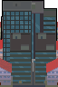
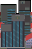
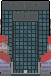
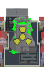
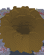

<h1 align="center">
  
  Gojira So Long
  
</h1>

So Long is a 2D game written in C with the MiniLibX graphics library.
The goal is to guide the player through a map, catch all the collectibles, and reach the exit while avoiding obstacles.

This project is part of the 42 curriculum, but at the request of my son, in this version the theme was adapted to feature Gojira as the main character, collecting nuclear reactors before escaping.

<p align="center">
  
  
  
  
  
  
  
  
  
</p>

## Features

- 2D top-down map exploration
- Basic movement (up, down, left, right)
- Collectibles (nuclear reactors) that must all be gathered to unlock the exit
- Exit tile that becomes available only after collecting everything
- Sprite-based rendering with MiniLibX graphics library
- Map validation: only valid maps are playable (rectangular shape, walls around, valid path, etc.)

## Getting Started

### Prerequisites

- GCC or another C compiler
- [MiniLibX](https://github.com/42paris/minilibx-linux.git) installed

### Build & Run

Clone the repository:
```sh
git clone https://github.com/DiogoFTL-Gomes/42-Gojira-So_long.git
cd 42-Gojira-So_long
git clone https://github.com/42paris/minilibx-linux.git mlx_linux
```

Compile:
```sh
make
```

Run:
```sh
./so_long [map_file]
```

Maps:
- All maps must be in .maps/
- inv_*.ber are parsing tests
- Try test_01.ber up to test_06.ber
- Try making your own maps

How to play:
- WASD to move
- Pick up nuclear reactors 
- Escape after eating all reactors 
- Press Esc or click the window close button to exit

## Credits

Developed by [DiogoFTL-Gomes]((https://github.com/DiogoFTL-Gomes))
license

---

Have fun!
